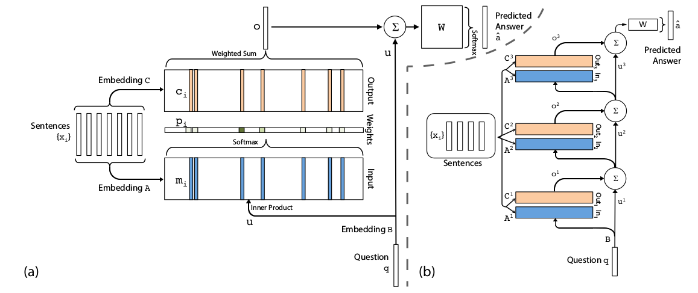

## End-to-End Memory Network
#### Approach

The model writes all $x$ to the memory up to a fixed buffer size, and then finds a continuous
representation for the $x$ and $q$

##### Single Layer
A single memory hop operation
###### Input memory representation
* input set $x_1,..,x_n$ stored in memory  
embedd each $x_i$ in a continuous space to $d$-dimension vectors {$m_i$} ig. use an embedding matrix $A$($d \times V$) $V$ is the size of vocalbulary  
* question $q$ is also embedded to obtain an internal state $u$
* compute match between $u$ and each memory $m_i$ by softmax:
	$p_i=Softmax(u^Tm_i)$
* Each $x_i$  has a corresponding output vector $c_i$
   respone vector from memory o is $o=\sum\limits_ip_ic_i$  
 
 
###### Generating the final prediction
$\hat{a}=Softmax(W(o+u))$  $W$ is a weight maxtrix ( $d \times V$)  

#### Architecture 

(a) is a single layer version (b) is a three layer version

##### Multiple Layer
To handle $K$-hop operation
* The input to layers above the first is the sum of the output $o^k$ and the input $u^k$ from layer $k$  
	$u^{k+1}=u^k+o^k$
* Each layer has its own embedding matrices $A^k$,$C^k$
* At the top predict layer  
	$\hat{a}=Softmax(Wu^{K+1})=Softmax(W(o^K+u^K))$
* Two types of weight tying within the model
	* Adjacent
	* Layer-wise(RNN-like)

#### Experiment
$K=3$ hops model with the adjacent scheme 
bAbi dataset
###### Sentence Representation
* Bag of word $m_i=\sum_jAx_{ij}$
* Position Encoding:	Another representation that encode the positions of words within sentence.  
$m_i=\sum_jl_j\cdot Ax_{ij}$  where $\cdot$ is an element-wise multiplication 
$l_j$ is a column vector structure  
$l_{kj}=(1-j/J)-(k/d)(1-2j/J)$   
J being the number of words in the sentence  
d is the dimension of the embedding  
k is the k_th hop  
###### Temporal Encoding
$m_i=\sum_jAx_{ij}+T_A(i)$ where  $T_A(i)$ is the $i$th row of a special matrix $T_A$ that encodes temporal information  
The ouput embedding is augmented i the same way