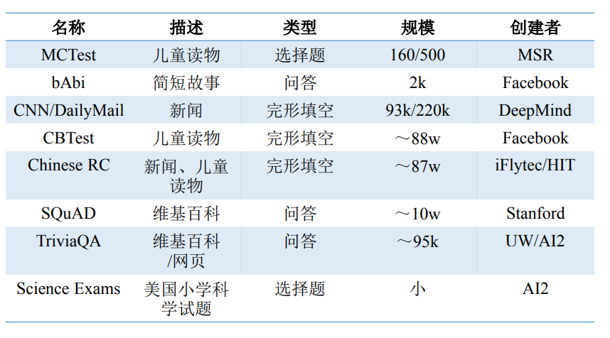

### Machine Reading Comprehension

#### Dataset

* BookTest https://arxiv.org/abs/1610.00956
* Rochester Story
CNN/Daily Mail、Facebook CBT、MCTest以及SQuAD主要侧重于自然语言理解，Facebook bAbI 更加侧重于考察机器的推理能力，而BioProcess和Rochester Story则更侧重于机器理解与融合外部知识的能力。
#### Typical Model
* Facebook bAbI Simple Questions 数据集
		(1) Memory Network
        (2) Adaptive Memory 该模型增加了一个终结符用于自动确定依赖句子的个数以及输出词的个数.
        (3) End-To-End Memory Networks的Dynamic Memory Network 仅融入了Adaptive Memory Netowrk自动判定推理终结的能力，还在模型中使用带attention机制的GRU模型代替了BOW模型，对输入层以及Memory进行处理，从而融入了语序信息并且获得更好的拟合.
* CNN/Daily Mail & Children’s Book Test
		(1) Attentive Reader
        (2) Impatient Reader 建模了问句中每一个词对文章中每个词的attention。该方法建模了人类进行阅读理解的过程：从左到右阅读问题，然后每看到一个词之后，都去原文中寻找对应部分，之后更新记忆，一直重复上述过程直到读完问题，然后选择答案。
* MCTest
		Wang 等人在[22] 中引入了大量来自于外部语料的信息(External Knowledge)。Wang等人将阅读理解任务划分为答案选择以及答案生成两个步骤，在这两个步骤中分别引入了从WikiQA上训练得到的答案选择模型以及一个外部的RTE模型，成功地学习到了一个能用于MCTest的端到端神经网络模型，取得了很好的效果。

        
 
 
