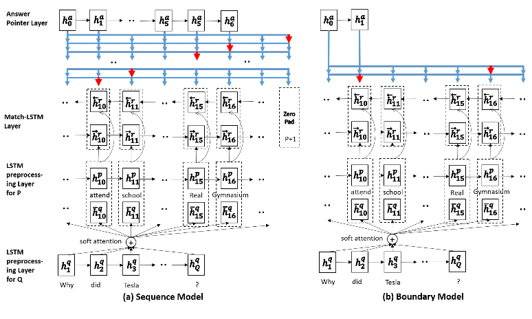
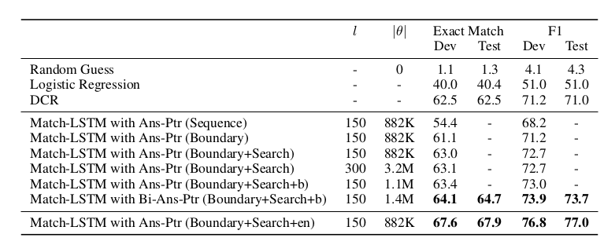

## Machine Comprehension Using Match-LSTM And Answer Pointer
### Abstract
Machine comprehension of text is an important problem in natural language pro-
cessing. A recently released dataset, the Stanford Question Answering Dataset
(SQuAD), offers a large number of real questions and their answers created by
humans through crowdsourcing. SQuAD provides a challenging testbed for eval-
uating machine comprehension algorithms, partly because compared with previ-
ous datasets, in SQuAD the answers do not come from a small set of candidate
answers and they have variable lengths. We propose an end-to-end neural architec-
ture for the task. The architecture is based on match-LSTM, a model we proposed
previously for textual entailment, and Pointer Net, a sequence-to-sequence model
proposed by Vinyals et al. (2015) to constrain the output tokens to be from the
input sequences. We propose two ways of using Pointer Net for our task. Our
experiments show that both of our two models substantially outperform the best
results obtained by Rajpurkar et al. (2016) using logistic regression and manually
crafted features
### Introduction
Predicted answer is a span in paragraph. 
Match-LSTM + Pointer Net(Ptr-Net)  
* We propose two new end-to-end neural network
models for machine comprehension, which combine match-LSTM and Ptr-Net to handle the special
properties of the SQuAD dataset.
* We have achieved the performance of an exact match score of 67.9% and an F1 score of 77.0% on the unseen test dataset, which is much better than the feature-
engineered solution (Rajpurkar et al., 2016)

### Method
#### MATCH-LSTM
Obtain a weighted vector representation of the premise.the weighted premise is then to  be combined with a vector representation of the current token of the hypothesis and fed to an LSTM.
#### POINTER NET
Ptr-Net uses attention mechanism as a pointer to select a position from input sequence as an output symbol.
#### Paper Method
Passage is represented by matrix $\boldsymbol{P}\in R^{d\times P}$ P is the length of passage and d is the dimentionality of word embeddings.  
The paper represent the answer as a sequence of integers $\boldsymbol{a}=(a_1,a_2,...)$ where $a_i\in(1,P)$ indicates a certain position in the passage.  

**Three layers** 
1. An LSTM preprocessing layer that preprocesses the passage and the question using LSTMs.
2. A match-LSTM layer that tries to match the passage against the question.
3. An Answer Pointer (Ans-Ptr) layer that uses Ptr-Net to select a set of tokens from the passage as the
answer.

##### The Sequence Model
In the Sequence Model,the answer is represented by a sequence of integers $\boldsymbol{a}=(a_1,a_2,...)$ indicating the positions of the selected tokens in the original passage.The Ans-Ptr layer models the generation of these integers in a sequential manner.
##### The Boundary Model
The boundary model works in a way very similar to the sequence model above, except that instead of predicting a sequence of indices $a_1,a_2,...$,we only need to predict two indices $a_s$ and $a_e$
  

An Overview of two models.Both models consist of an LSTM preprocessing layer,a match-LSTM layer and an Answer Pointer layer .
#### Experiments
##### Data
Use SQuAD dataset (v1.1) to conduct our experiments.Pas-
sages in SQuAD come from 536 articles from Wikipedia covering a wide range of topics. Each passage is a single paragraph from a Wikipedia article, and each passage has around 5 questions associated with it. In total, there are 23,215 passages and 107,785 questions. The data has been split into a training set (with 87,599 question-answer pairs), a development set (with 10,570 question-answer pairs) and a hidden test set.
##### Experiments Settings
We first tokenize all the passages, questions and answers. The resulting vocabulary contains 117K
unique words. We use word embeddings from GloVe (Pennington et al., 2014) to initialize the
model. Words not found in GloVe are initialized as zero vectors. The word embeddings are not
updated during the training of the model.
The dimensionality l of the hidden layers is set to be 150 or 300. We use ADAMAX (Kingma &
Ba, 2015) with the coefficients $\beta_1=0.9$ $\beta_2 = 0.999$ to optimize the model. Each update is
computed through a minibatch of 30 instances. We do not use L2-regularization.
The performance is measured by two metrics: percentage of exact match with the ground truth
answers, and word-level F1 score when comparing the tokens in the predicted answers with the
tokens in the ground truth answers. Note that in the development set and the test set each question has
around three ground truth answers. F1 scores with the best matching answers are used to compute
the average F1 score.
##### Result
  
The results of our models as well as the results of the baselines given by Rajpurkar et al. (2016) and
Yu et al. (2016) are shown in Table 2. We can see that both of our two models have clearly outperformed the logistic regression model by Rajpurkar et al. (2016), which relies on carefully designed features. Furthermore, our boundary model has outperformed the sequence model, achieving an exact match score of 61.1% and an F1 score of 71.2%. In particular, in terms of the exact match score,the boundary model has a clear advantage over the sequence model. The improvement of our modelsover the logistic regression model shows that our end-to-end neural network models without much
feature engineering are very effective on this task and this dataset. Considering the effectiveness of
boundary model, we further explore this model. Observing that most of the answers are the spans
with relatively small sizes, we simply limit the largest predicted span to have no more than 15 tokens
and conducted experiment with span searching This resulted in 1.5% improvement in F1 on the de-
velopment data and that outperformed the DCR model (Yu et al., 2016), which also introduced some
language features such as POS and NE into their model. Besides, we tried to increase the memory
dimension l in the model or add bi-directional pre-processing LSTM or add bi-directional Ans-Ptr.
The improvement on the development data using the first two methods is quite small. While by
adding Bi-Ans-Ptr with bi-directional pre-processing LSTM, we can get 1.2% improvement in F1.
Finally, we explore the ensemble method by simply computing the product of the boundary prob-
abilities collected from 5 boundary models and then searching the most likely span with no more
than 15 tokens. This ensemble method achieved the best performance as shown in the table.