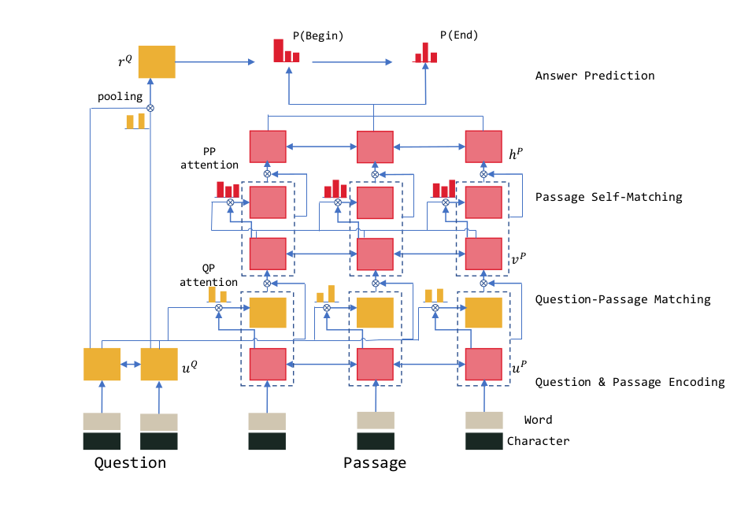

### Introduction
**Composition**  
1) the recurrent network encoder to build representation for questions and passages separately;  
2) the gated matching layer to match the question and passage;  
3) the self-matching layer to aggregate information from the whole passage;  
4) the pointer-network based answer boundary prediction layer.
### R-NET Structure
##### Overview

* First,bi-rnn encodes questions and passage seperately.
* Second,match the question and passage with gate attention based rnn to acquire question-aware passage representation.
* Third,apply self-matching attention to aggregate evidence from the whole passage and refine the passage representation
##### Question And Passage Encoder
Use both word-level embeddings of questions and passages $\{e^Q_t\}^m_{t=1}$ ,$\{e^P_t\}^n_{t=1}$ and character-level embedding $\{c^Q_t\}^m_{t=1}$ ,$\{c^P_t\}^n_{t=1}$  
The character-level embeddings are generated by taking the final hidden
states of a bi-directional recurrent neural network (RNN) applied to embeddings of characters in the
token.Such  character-level can help deal with out of vocabulary problem.   
$u^Q_t=BiRNN_Q(u^Q_{t-1},[e^Q_t,c^Q_t])$  
$u^P_t=BiRNN_P(u^P_{t-1},[e^P_t,c^P_t])$ 
##### Gated Attention-Based Reccurent Networks
sentence-pair representation $\{v^P_t\}^n_{t=1}$  
$v^P_t=RNN(v^P_{t-1},c_t)$ where  
$c_t=att(u^Q,[u^P_t,v^P_{t-1}])$ an attention-pooling vector of the whole question($u^Q$)  
gated attention-based recurrent networks  
$g_t=sigmoid(W_g[u^P_t,c_t])$  
$[u^P_t,c_t]^*=g_t\bigodot[u^P_t,c_t]$  
The gate effectively model the phenomenon that only parts of the passage are relevant to the question in reading comprehension and question answering.
