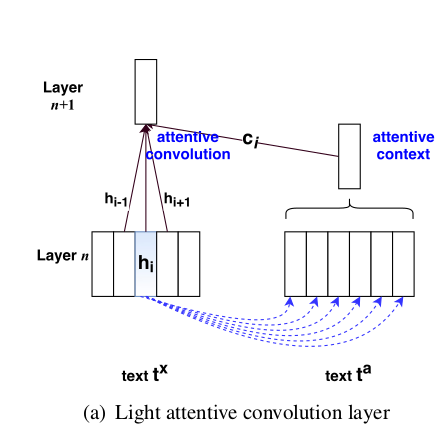

## Points
* Attentive Layers applied to convolution layers
* It extends the context scope of the convolution operation, deriving higher-level features for a word not only from localcontext, but also from information extracted from nonlocal context by the attention mechanism commonly used in RNNs
* Attention-based RNNs typically take three types of
input to make a decision at current step: (i) the current input state, (ii) a representation of local context (computed unidirectionaly or bidirectionally,
Rocktäschel et al. (2016)) and (iii) the attention-
weighted sum of hidden states corresponding to
nonlocal context (e.g., the hidden states of the encoder in neural machine translation (Bahdanau et al.,
2015a))
* our attentive convolutionb work differs from attentive pooling in that it uses attended hidden states from extra context (intertext) or broader context range (intratext) to participate in the convolution

## Machine comprehension papers

* Teaching machines to read and comprehend
* Dynamic memory networks for visual and textual question answering
* Learning natural language inference with LSTM
* Dynamic coattention networks for question answering
* Bidirectional attention flow for machine comprehension
* Reading wikipedia to answer open domain questions.
* Long short-term memory-networks for machine reading

## Model
  
##### Attentive Context Vector Generation
energy function $f_e(\boldsymbol{h}_i^x,\boldsymbol{h}_j^a)$ 