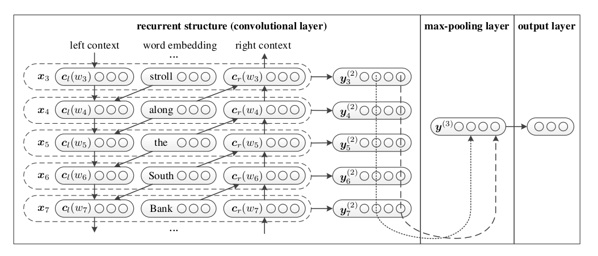

## Points
- High order n-gram features can capture more contextual features and word orders.However causes data sparsity problem affect classfication accuracy heavily.
- pre-trained word embeddings can capture meaningful syntactic and semantic regularities.
- Socher et al. (2011a; 2011b; 2013) proposed the Recursive Neural Network (RecursiveNN) that has been provento be efficient in terms of constructing sentence representations.
- he RecursiveNN captures the semantics of a sentence via a tree structure. Its performance heavily depends on the performance of the textual tree construction.
- RecursiveNN $O(n^2)$  RecurrentNN $O(n)$ time complexity where n is the length of sentence.
- rcnn = bi-rnn+max pooling
- The difference between CNNs and RCNNs is that they use different structure for capturing contextual information.
- A small window may result in a loss of some long-distance patterns
## Model
#### Word Representation
Combination of the word and its context. 
$\boldsymbol{c_l}(w_i)$ as left context of $w_i$ , $\boldsymbol{c_r}(w_i)$ as right context of $w_i$  
$\boldsymbol{c_l}(w_i)=f(W^{(l)}\boldsymbol{c_l}(w_{i-1})+W^{(sl)}\boldsymbol{e}(w_{i-1}))$  
$\boldsymbol{c_r}(w_i)=f(W^{(r)}\boldsymbol{c_r}(w_{i-1})+W^{(sr)}\boldsymbol{e}(w_{r-1}))$	 

	#### Architecture
  
#### Math
$\boldsymbol{x_i}=[\boldsymbol{c_l}(w_i);\boldsymbol{e}(w_i);\boldsymbol{c_r}(w_i)]$  
sematic vectors  $\boldsymbol{y}_i^{(2)}=trah(W^{(2)}\boldsymbol{x}_i+\boldsymbol{b}^{(2)})$
#### Training
* Initialize all of the parameters in the neural
network from a uniform distribution
* stochastic gradient descent α as 0.01
